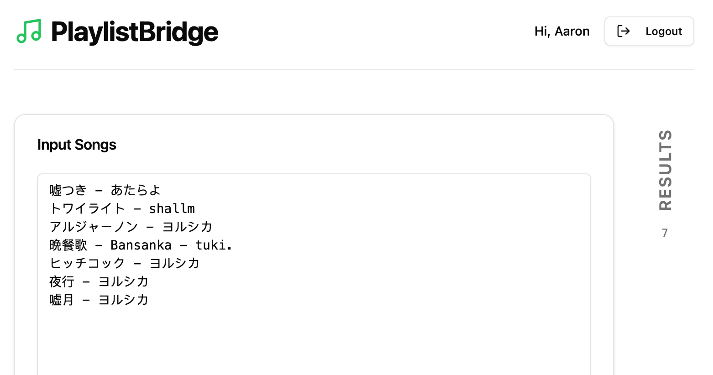
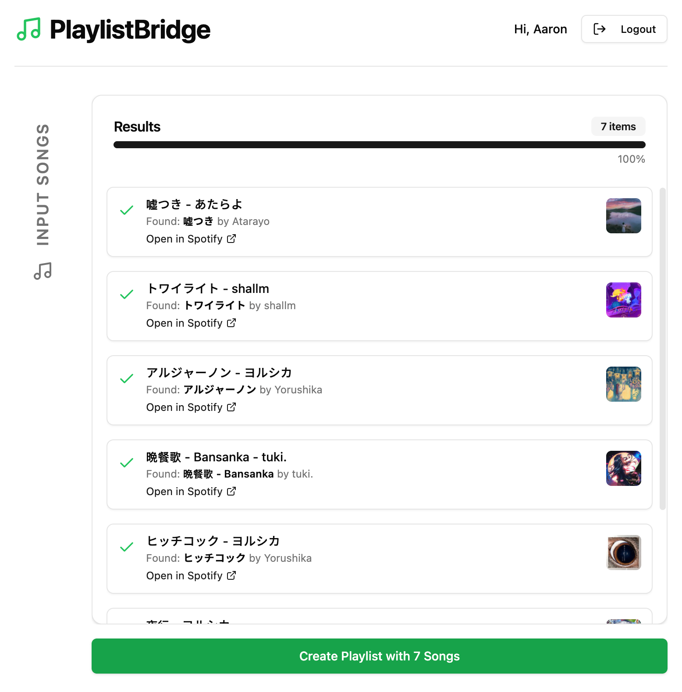
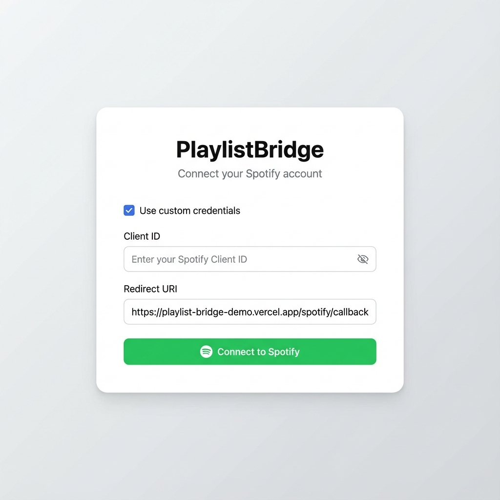

## 这是什么？

这个工具将 '歌曲 - 艺术家' 对转换为 Spotify 播放列表。

## 为什么需要另一个播放列表转换工具？

我发现像 Spotlistr 和 Tune My Music 这样的现有工具通常不能很好地处理日语歌曲。

测试数据集：
```
嘘つき - あたらよ
トワイライト - shallm
アルジャーノン - ヨルシカ
晩餐歌 - Bansanka - tuki.
ヒッチコック - ヨルシカ
夜行 - ヨルシカ
嘘月 - ヨルシカ
```

此工具是 [GoMusic](https://github.com/Bistutu/GoMusic) 的配套工具，GoMusic 可以将网易云音乐播放列表解析为干净的 “歌曲 – 艺术家” 对，从而更容易实现准确的转换。





## 如何使用

### 0. [可选] 从 GoMusic 获取播放列表文本

请参考 [https://github.com/Bistutu/GoMusic](https://github.com/Bistutu/GoMusic)

### 1. 获取 Spotify Client ID 并设置 Redirect URI

要将 PlaylistBridge 连接到 Spotify，你需要一个 Client ID。请按照以下步骤操作：

1.  前往 [Spotify Developer Dashboard](https://developer.spotify.com/dashboard)。
2.  使用你的 Spotify 账号登录。
3.  点击 **"Create App"**。
4.  填写 App Name（例如 "PlaylistBridge"）
5.  在 **Redirect URIs** 部分，添加以下 URL：
    ```
    https://playlist-bridge-demo.vercel.app/spotify/callback
    ```
    *（注意：你也可以选择自行托管，如果是这样，请在此处填写你自己的端点）*
6.  保存应用。
7.  在你的应用仪表板页面上，找到 **Client ID**。

### 2. 在 PlaylistBridge 中使用自定义凭据

一旦你有了 Client ID，就可以在 PlaylistBridge 应用中使用它：

1.  打开 PlaylistBridge 登录页面。
2.  勾选 **"Use custom credentials"** 复选框。
3.  在 "Client ID" 字段中输入你的 **Client ID**。
4.  输入你在 Spotify Dashboard 中配置的 **Redirect URI**（例如 `https://playlist-bridge-demo.vercel.app/spotify/callback`）。
5.  点击 **"Connect to Spotify"**。



你的凭据将保存在浏览器的本地存储中，因此你无需每次都输入。

## 待办事项：

- [ ] 测量输入歌曲与匹配歌曲之间的相似度
